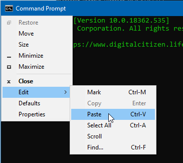

# Info for Windows Operating System users

## Turning on filename extensions

Windows has filename extensions hidden by default, which is bad because it makes it easier for people to run malicious programs disguised as an image or text file. It also makes it harder to change file types or work with things on the command line. To enable filename extensions:

1. Open up any windows folder.
2. Click on the *View* menu at the top.
3. Near the top right of the folder should now be an option called *File name extensions*. Ensure that option is checked.

## Using the command line

The command line (aka command prompt or incorrectly as the "DOS prompt") is a program on windows (and other OSes) that you can use to run text commands that you can use to run programs and manipulate files and folders on your computer. Many advanced tasks require the use of the command line. On windows, this program is called **cmd.exe**.

The easiest way to open it is to go to your start menu and search for "cmd".

:max_bytes(150000):strip_icc():format(webp)/open-command-prompt-w10-5c19531146e0fb00013852e8.png)

Commands must be entered into Command Prompt exactly. The wrong [syntax](https://www.lifewire.com/what-is-syntax-2626014) or a misspelling could cause the command to fail or worse: it could execute the wrong command or the right command in the wrong way. 

The most important things you'll need to know how to do for this guide are how to paste, and how to use the `cd` command.

#### How to paste into the command prompt

On some systems, ctrl-v does not work to paste. If this is the case, paste by clicking on the top left of the window (on the icon), select *Edit*, then select *Paste*.

#### How to use the `cd` command.

The command `cd` stands for `c`hange `d`irectory. You can think of this the same way you would double click on a folder and then be "in" that folder. Note that "directory" and "folder" both mean the same thing in this context.

* Change to a particular folder: In this guide, usually you'll simply want to change to a particular folder. To do that type a command of the form `cd <folder you want to go to>`, for example, to go to `C:\Users\you\Desktop\pics`  you would type `cd C:\Users\fresh\Desktop\pics` and then press enter to submit the command. Use the instructions *How to paste into the command prompt* to make this easier. You can copy the path a folder is at by clicking to the right of the folder's address bar.
  * If you're changing to a directory with a different drive letter than your current working directory, you'll need to additionally type that drive letter. For example, if your command prompt's line starts with `C:\Users\yourUsername>` and you need to switch to the directory `D:\some-folder\`, then you'll need to type `d:` into the command prompt and press enter. You can do this before or after the `cd` command.
* Usually, when you start the command prompt, your "working directory" (the folder you start in) is the folder that contains your desktop's files. So if you're just trying to get to your desktop, enter the command `cd Desktop`.