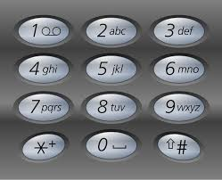
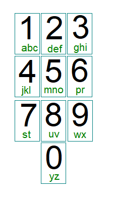

This directory contains `numeralEncodingSecurity.js` which is a script that calculates cracking time for a couple word lists as well as for those word lists after transforming the words to numbers where each letter is represented by a single number.

For example, using the following number pad "boyhowdy" would be represented as "16946939":

And on the following number pad "boyhowdy" would be represented as "15035920":

One consequence of this is that some words have the same numeric representation. For example, "bat" and "cat" have the same numeric representation (in both numberpads above). This reduces the number of possible passphrases and thus password security.

To test this, I used two EFF dictionaries:

* [The Long Diceware dictionary](https://www.eff.org/files/2016/07/18/eff_large_wordlist.txt)
* [The Short Diceware dictionary](https://www.eff.org/files/2016/09/08/eff_short_wordlist_1.txt)

The long dictionary has 7772 alpha-only words (no hyphens), and 157 of those words map to the same numeric representation as other words using the 0-9 keypad, and 216 have duplicates with the 2-9 keypad.

Similarly, the short dictionary has 1295 alpha-only words, 74 have duplicates using the 0-9 keypad, and 94 have duplicates using the 2-9 keypad.

Interestingly, neither encoding seems to lose much entropy vs using the alphanumeric characters. This shouldn't be that surprising, since limiting yourself to dictionary words already loses a lot of entropy, and the number of duplicates aren't that high (only about 2%-6% of words). It is surprising to me tho, that it seems to make essentially no significant difference in cracking time whatsoever.

To run the program and see the details yourself, run `node numeralEncodingSecurity`.